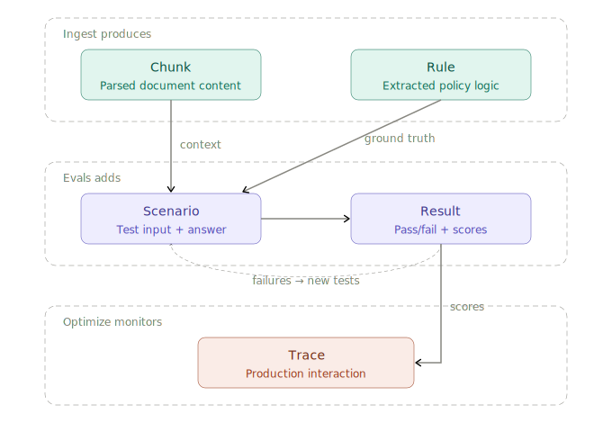

# Evergreen Ingest

**Close the gap between policy intent and implementation in the AI era.**

A policy expert uploads two documents — the authoritative source policy and an implementation artifact (training manual, agent script, FAQ, knowledge base). They define what parameters matter. The tool extracts those parameters from both documents, shows the differences side by side, and lets the expert validate each one.

The output is two production-ready artifacts:

- **A golden dataset** — SME-validated parameters, each grounded to exact policy text, for use as eval ground truth or monitoring baselines.
- **Grounded document chunks** — source passages with full lineage metadata, ready to embed and index into a vector store for policy-grounded RAG.

One review pass produces both. The expert validates once; everything downstream benefits.

---

## Who uses this

A DOR tax policy lead verifying that a call-center training manual reflects the current year's thresholds. A CDLE unemployment program manager checking that an AI assistant's knowledge base matches the current benefit rules. Any team responsible for keeping implementation aligned with policy — especially before that implementation becomes the context window of an AI system.

---

## User flow

```
Ingest → Extract → Review → Validate → Report
```

### 1. Ingest
Upload two documents: the source policy (the authority) and an implementation artifact (what is actually in use). Accepts PDF, DOCX, HTML, Markdown, or plain text up to 5 MB. Select a domain (tax, benefits) to load a preset extraction schema, or write a custom prompt.

### 2. Extract
[langextract](https://github.com/google-deepmind/langextract) runs on both documents using the same schema. Each parameter is extracted as a structured object with:
- Exact source text (character-level grounding)
- Structured attributes (`parameter`, `value`, and domain-specific keys)
- An interactive HTML visualization linking back to the source passage

Extraction runs sequentially (policy then implementation) in a background thread. The browser polls for status every 4 seconds.

### 3. Review
Side-by-side drift comparison. Every extracted parameter is categorized:

| Status | Meaning |
|--------|---------|
| **Matched** | Same parameter, same value in both documents |
| **Drifted** | Same parameter, different values — implementation may be outdated |
| **Missing** | Parameter exists in policy but is absent from implementation |
| **Extra** | Parameter exists in implementation but has no match in current policy |

Filter by status tab. Quick-confirm or quick-reject directly from the list. Keyboard shortcuts: `j`/`k` to navigate, `c` to confirm, `r` to reject, `Enter` to open detail view.

### 4. Validate
For each drifted, missing, or extra parameter, the expert chooses a decision:

- **Confirm** — Policy is correct. Flag the implementation for update.
- **Edit** — Supply the corrected value. The original extraction is preserved alongside the expert's version.
- **Reject** — Not a real drift, false positive, or the policy itself needs review.

Each decision saves immediately. A progress counter tracks how many actionable findings have been reviewed.

### 5. Report
A shareable drift report showing what matched, what drifted, what was validated, and what still needs attention. Exportable as:

| Format | Use |
|--------|-----|
| `report.jsonl` | Canonical schema for vector stores, Langfuse datasets, Evergreen Evals |
| `report.csv` | Spreadsheet review, stakeholder sharing |
| `report.json` | Full comparison + validation state |
| Print / PDF | Audit trail, meeting handout |

---

## Architecture



```
Source policy ─────┐
                   ├──→ langextract (same schema) ──→ compare ──→ validate ──→ report
Implementation ────┘
                                                                        │
                                                          ┌─────────────┴──────────────┐
                                                          │                            │
                                                   Golden dataset              Grounded chunks
                                                   (eval ground truth)         (vector store / RAG)
```

### Components

**`app.py`** — FastAPI application. All routes. Extraction runs in a `ThreadPoolExecutor` so the async event loop is never blocked by synchronous langextract calls. The browser polls `/compare/{id}/status` until `meta.json` status is `ready`.

**`extract.py`** — langextract integration. Reads the document, builds the extraction schema from domain examples, calls `lx.extract()` directly (no thread wrapper), generates and saves the HTML visualization. Uses `_TimedOpenAILanguageModel` to inject an explicit HTTP timeout into OpenAI calls (langextract's default is 600 s with no timeout override).

**`compare.py`** — Diff logic. Matches parameters by extraction class and a similarity function: exact parameter name match → substring match → key-overlap fallback (Jaccard). Greedy best-match within each class, threshold 0.3. Detects drifted attributes by normalized value comparison.

**`validate.py`** — Validation state. Atomic writes via `os.replace`. One JSON file per comparison at `output/validations/{id}/state.json`.

**`examples/`** — Few-shot extraction schemas per domain. Each domain defines parameter types, a prompt description, and one example extraction. Adding a new domain is one file.

### Storage layout

```
output/
├── comparisons/{id}/
│   ├── meta.json          # status, filenames, model, display name, logs
│   └── comparison.json    # all parameters with status and attributes
├── extractions/{id}/
│   ├── policy.jsonl       # raw langextract output (immutable)
│   └── implementation.jsonl
├── validations/{id}/
│   └── state.json         # expert decisions, keyed by param index
└── visualizations/{id}/
    ├── policy.html        # langextract interactive source view
    └── implementation.html

sources/
└── {id}_policy.{ext}      # uploaded documents (gitignored)
    {id}_implementation.{ext}
```

**Immutability.** Source documents and raw extractions are never modified. Validation writes to a separate directory. Re-running extraction with a better model produces a new comparison ID; the original is preserved.

---

## Data schema

The canonical export (`report.jsonl`) uses one record per parameter. This schema is designed to map directly to all downstream consumers without a translation layer.

```json
{
  "id": "20260315T123456_abc123:0",

  "domain": "tax",
  "extraction_class": "FilingThreshold",
  "attributes": { "parameter": "filing threshold single", "value": "$14,600" },

  "policy_text":     "For tax year 2024, the standard filing threshold for single filers is $14,600.",
  "policy_chars":    [1234, 1301],
  "policy_document": "policy_tax_current.md",

  "impl_text":     "For tax year 2023, the standard filing threshold was $13,590.",
  "impl_chars":    [892, 957],
  "impl_document": "training_manual_tax_stale.md",

  "status":       "drifted",
  "drifted_keys": ["value"],

  "decision":         "confirmed",
  "corrected_value":  null,
  "note":             "Implementation carries 2023 value, needs update",
  "decided_at":       "2026-03-15T14:23:11Z",

  "comparison_id": "20260315T123456_abc123",
  "model":         "gpt-4o-mini",
  "created_at":    "2026-03-15T14:20:00Z"
}
```

### Field reference

| Field | Type | Description |
|-------|------|-------------|
| `id` | string | Stable cross-system identifier: `{comparison_id}:{index}` |
| `domain` | string | Extraction domain: `tax`, `benefits`, … |
| `extraction_class` | string | Parameter type as defined in the domain schema |
| `attributes` | object | Structured key-value pairs extracted by langextract |
| `policy_text` | string | Exact quoted text from the policy document |
| `policy_chars` | `[int, int]` | Character positions `[start, end]` in the policy source |
| `policy_document` | string | Source filename |
| `impl_text` | string \| null | Exact quoted text from the implementation artifact |
| `impl_chars` | `[int, int]` \| null | Character positions in the implementation source |
| `impl_document` | string \| null | Implementation filename |
| `status` | enum | `matched` / `drifted` / `missing` / `extra` |
| `drifted_keys` | string[] | Attribute keys whose values differ between documents |
| `decision` | enum \| null | `confirmed` / `edited` / `rejected` / `null` (pending) |
| `corrected_value` | object \| null | Expert-supplied correction when `decision == "edited"` |
| `note` | string \| null | Expert annotation |
| `decided_at` | ISO timestamp \| null | When the decision was recorded |
| `comparison_id` | string | Links back to the full comparison session |
| `model` | string | LLM used for extraction |
| `created_at` | ISO timestamp | When the comparison was created |

### How downstream consumers use this schema

**Vector store (Pinecone, Qdrant, pgvector, …)**
Embed `policy_text`. Store all other fields as metadata/payload. Use `policy_chars` to expand the retrieval context window at query time. Filter patterns:
```
decision == "confirmed"                    → only SME-validated content
status IN ["drifted", "missing"]           → known problem areas
extraction_class == "FilingThreshold"      → parameter-type scoping
domain == "tax" AND decision == "confirmed" → domain-scoped ground truth
```

**Langfuse dataset**
```json
{
  "input":           { "question": "..." },
  "expected_output": "<value from attributes.value>",
  "metadata":        { ...all other fields... }
}
```
Filter eval results by `metadata.status` or `metadata.extraction_class` to segment performance by drift type or parameter category.

**Evergreen Evals (Promptfoo)**
Derive `question` from `extraction_class` + `attributes.parameter`. Set `expected_answer` from `policy_text` or `attributes.value`. Map `status == "drifted"` → severity `Critical`. The full record is available as Promptfoo test case metadata and surfaces in the compliance report on failure.

---

## Running

```bash
cp .env.example .env
# Add ANTHROPIC_API_KEY (default), OPENAI_API_KEY, or GOOGLE_API_KEY

pip install -r requirements.txt
python app.py
# → http://localhost:8000
```

### Configuration (`config.yaml`)

| Key | Default | Description |
|-----|---------|-------------|
| `model_id` | `gpt-4o-mini` | Default extraction model |
| `max_workers` | `10` | langextract internal parallelism across chunks |
| `max_char_buffer` | `6000` | Expanded dynamically to fit the full document in one chunk |
| `api_timeout` | `200` | Per-call HTTP timeout in seconds |
| `extraction_passes` | `1` | Passes over the document (more = higher recall, slower) |
| `max_output_tokens` | `2048` | Max tokens per LLM response |

### Supported models

| Model | Provider | Notes |
|-------|----------|-------|
| `claude-sonnet-4-6` | Anthropic | **Default** · 200K context, recommended |
| `claude-haiku-4-5` | Anthropic | Fast, low cost, 200K context |
| `claude-opus-4-6` | Anthropic | Most capable, 200K context |
| `gpt-4o-mini` | OpenAI | Fast, low cost, 128K context |
| `gpt-4o` | OpenAI | Higher accuracy, 128K context |
| `gpt-4.1-mini` | OpenAI | 1M context, low cost |
| `gpt-4.1` | OpenAI | 1M context, highest accuracy |
| `gemini-2.5-flash` | Google | Very low cost, 1M context, best for large docs |
| `gemini-2.0-flash` | Google | Low cost, 1M context |

---

## Testing

```bash
# Unit tests — no API key required
pytest tests/test_compare.py tests/test_validate.py -v

# Full integration tests — requires OPENAI_API_KEY or GOOGLE_API_KEY
pytest tests/ -v
```

The fixture documents in `tests/fixtures/` contain intentional drift for both the tax and benefits domains. See `CLAUDE.md` for the full drift table.

---

## Design principles

- **Source grounding is non-negotiable.** Every parameter links to the exact text it came from. Edits preserve the original extraction alongside the expert's version.
- **Immutability.** Raw extractions are never overwritten. Every reprocessing run creates a new comparison ID.
- **Flat files, no database.** JSON and JSONL throughout. No migration scripts, no schema versions, no running services beyond the app itself.
- **One canonical schema.** The `report.jsonl` export is designed so that vector stores, eval frameworks, and observability platforms can consume it directly with no translation layer.
- **The demo is explainable in one sentence.** Upload your policy and your training manual, see what's different.

---

## Roadmap

| Next | Description |
|------|-------------|
| **Evals integration** | Export directly to [Evergreen Evals](https://github.com/akschneider1/Evergreen-Evals) as Promptfoo test cases; push to Langfuse as a named dataset |
| **Rules as code** | Export confirmed parameters as YAML/JSON Schema for rules engines and AI guardrails |
| **Monitor** | Scheduled re-comparison when policy documents are updated; alert on new drift |
| **Dataset** | Cross-comparison parameter history and version tracking across policy revisions |

---

*Source grounding powered by [langextract](https://github.com/google-deepmind/langextract) (Google DeepMind, Apache 2.0).*
